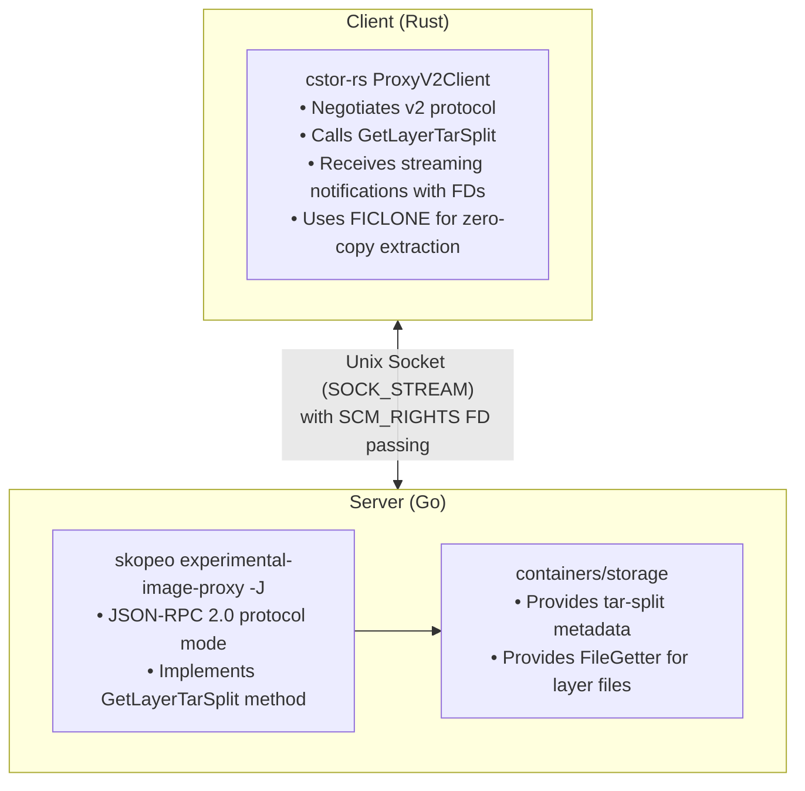

# cstor-rs

Read-only Rust reimplementation of [containers/storage](https://github.com/containers/storage) (overlay driver).

NOTE: This codebase was 80% directly written via Anthropic's Sonnet and Opus models.

## Overview

This library provides direct read access to container images stored in containers-storage without requiring tar serialization (see [containers/storage#144](https://github.com/containers/storage/issues/144)). It is a pure Rust implementation that can read the on-disk format created by podman, buildah, and other tools using containers/storage.

The core innovation is using tar-split metadata to reconstruct tar archives without walking filesystem directories, streaming tar headers from metadata while passing file descriptors directly for regular files. This enables zero-copy operations on copy-on-write filesystems.

### What This Reimplements

The library reimplements read-only access to:

- **SQLite database** (`$root/db.sql`) - Layer and image metadata queries
- **Overlay filesystem layout** (`$root/overlay/<layer-id>/diff/`) - Direct file access
- **tar-split metadata** (`$root/overlay-layers/<layer-id>.tar-split.gz`) - Bit-for-bit tar reconstruction
- **Image manifests/config** (`$root/overlay-images/<image-id>/`) - OCI image metadata
- **Link symlinks** (`$root/overlay/l/`) - Short link identifier resolution
- **storage.conf parsing** - Storage root discovery and configuration

This is useful for tools that need to read container storage without linking against the Go containers/storage library, or for cases where read-only access with zero-copy extraction is desired.

## Zero-Copy Container Extraction (Proxy v2)

This project is developing infrastructure to enable **zero-copy container layer extraction** by integrating cstor-rs with skopeo's experimental-image-proxy. The key innovation is using **JSON-RPC 2.0 with file descriptor passing** over Unix sockets to stream tar-split metadata with FDs, enabling `FICLONE` reflinks on copy-on-write filesystems.

See [docs/proxy-v2-design.md](docs/proxy-v2-design.md) for the protocol specification.

### Related Projects

| Project | Purpose |
|---------|---------|
| [jsonrpc-fdpass](https://github.com/cgwalters/jsonrpc-fdpass) | Rust crate for JSON-RPC 2.0 with SCM_RIGHTS FD passing |
| [jsonrpc-fdpass-go](https://github.com/cgwalters/jsonrpc-fdpass-go) | Go library for JSON-RPC 2.0 with FD passing |
| [skopeo](https://github.com/containers/skopeo) | Container image utility (fork adds `-J` flag for JSON-RPC protocol) |

### Architecture



### Wire Protocol Example

```json
// Request
{"jsonrpc":"2.0","method":"Initialize","params":[],"id":1}

// Response
{"jsonrpc":"2.0","result":{"value":{"version":"1.0.0","v1_compat":"0.2.8"}},"id":1}

// Streaming layer extraction (planned)
{"jsonrpc":"2.0","method":"GetLayerTarSplit","params":{"image_id":1,"layer_digest":"sha256:..."},"id":3}

// Notifications with FD passing
{"jsonrpc":"2.0","method":"layer.start","params":{"digest":"sha256:...","uncompressed_size":12345}}
{"jsonrpc":"2.0","method":"layer.segment","params":{"data":"<base64>"}}
{"jsonrpc":"2.0","method":"layer.file","params":{"name":"bin/sh","size":1234,"fd":{"__jsonrpc_fd__":true,"index":0}}}
{"jsonrpc":"2.0","method":"layer.end","params":{"files_sent":42}}
```

## Features

**Core Capabilities:**
- **Zero-copy layer access**: File descriptors instead of data serialization
- **tar-split integration**: Bit-for-bit identical TAR reconstruction from metadata
- **Capability-based security**: All file operations use cap-std for path traversal protection
- **Read-only by design**: No modifications to containers-storage
- **OCI compatibility**: Full oci-spec and ocidir integration for standard image formats
- **TOC generation**: eStargz-compatible Table of Contents for layer indexing
- **Reflink extraction**: Efficient copy-on-write extraction on btrfs/XFS filesystems
- **Direct file access**: Layer::open_file_std() API for reading individual files

**Implementation Highlights:**
- Rust implementation of tar-split format parser
- Layer chain resolution with overlay semantics (handling parent layers)
- Whiteout and opaque whiteout handling
- SQLite database access for storage metadata
- Link identifier resolution through symlink directory
- CRC64 verification for file integrity
- Automatic rootless mode support via podman unshare re-exec

**Storage Format Support:**
- All formats documented in "What This Reimplements" above

## Command-Line Tools

### cstor-rs

Main CLI tool exposing all library functionality. Automatically handles rootless mode by re-executing via `podman unshare` when needed for file access.

```bash
# List all images in storage
cstor-rs list-images --verbose

# Show image details
cstor-rs inspect-image <image-id> --layers

# List layers for an image
cstor-rs list-layers <image-id>

# Inspect layer details
cstor-rs inspect-layer <layer-id> --chain

# Export a layer as tar stream (uses tar-split for reconstruction)
cstor-rs export-layer <layer-id> -o layer.tar

# Copy image to OCI directory layout
cstor-rs copy-to-oci <image-id> /path/to/oci-dir

# Extract image to directory using reflinks (zero-copy on btrfs/XFS)
cstor-rs reflink-to-dir <image-id> /path/to/output-dir [--force-copy]

# Generate Table of Contents (TOC) as JSON
cstor-rs toc <image-id> --pretty

# Resolve a link ID to layer ID
cstor-rs resolve-link <link-id>
```

The CLI automatically re-executes via `podman unshare` when running as non-root for commands that need file access (export-layer, copy-to-oci, reflink-to-dir), ensuring correct UID/GID mappings.

### tar-diff

Debugging tool for comparing tar archives byte-by-byte. Useful for verifying that tar-split reconstruction produces identical output.

```bash
# Compare two tar archives
tar-diff original.tar reconstructed.tar
```

The tool reports missing entries, extra entries, and metadata/content differences between the archives.

## Library Usage

The CLI serves as a demonstration of using this library from Rust for nontrivial use cases. For API examples and documentation, see the module-level documentation via `cargo doc --open`. The CLI source code in `src/bin/cstor-rs.rs` provides practical examples of all major library features.

## Prerequisites

- **Rust**: Edition 2024 (nightly or recent stable with edition support)
- **Runtime**: podman installed (for rootless mode re-exec via `podman unshare`)
- **Storage**: Existing containers-storage with overlay driver (created by podman/buildah)

## Building

```bash
# Build library and all binaries
cargo build --release

# Build specific binary
cargo build --release --bin cstor-rs
```

## Documentation

The library includes comprehensive module-level documentation:

```bash
cargo doc --open
```

Key modules:
- `storage`: Storage discovery and root directory access
- `image`: Image manifest and configuration parsing
- `layer`: Layer hierarchy, chain resolution, and file access
- `tar_split`: tar-split format parsing and TarSplitFdStream
- `tar_writer`: TAR header writing utilities
- `toc`: Table of Contents generation (eStargz-compatible)
- `config`: storage.conf parsing
- `error`: Error types and handling
- `proxy_v2`: Client for skopeo v2 protocol with JSON-RPC FD passing

## Testing

### Unit Tests

```bash
cargo test
```

### Integration Tests

The project includes comprehensive integration tests that verify tar reassembly produces bit-for-bit identical archives:

```bash
# Ensure test image exists
podman pull busybox

# Run integration tests (requires podman)
cargo test --test integration_test -- --ignored --nocapture
```

The integration tests verify:
- Tar-split reconstruction produces bit-for-bit identical tar archives
- Layer chain resolution handles overlay semantics correctly
- File descriptor passing works for regular files
- Whiteout files are processed correctly
- Reflink extraction works on supported filesystems

### Skopeo JSON-RPC Integration Tests

To test the skopeo JSON-RPC integration (requires skopeo built with `-J` flag support):

```bash
# In the jsonrpc-fdpass crate directory
cargo test --test skopeo_integration -- --ignored --nocapture
```

This tests:
- Spawning skopeo with `-J` flag via socketpair
- Sending Initialize request and verifying response
- Error handling with unknown methods
- Clean shutdown

## Development Status

### Completed

**Core Library (containers-storage reimplementation):**
- Read-only access to containers-storage overlay driver format
- SQLite database queries for layer/image metadata
- tar-split parsing and bit-for-bit tar reconstruction
- Layer chain resolution with overlay semantics
- Whiteout and opaque whiteout handling
- Reflink extraction on CoW filesystems
- CLI tools for inspection, export, and extraction

**Proxy v2 Infrastructure:**
- **jsonrpc-fdpass-go**: Go library for JSON-RPC 2.0 with SCM_RIGHTS FD passing
- **skopeo -J flag**: Added JSON-RPC 2.0 mode to `experimental-image-proxy`
- **Integration tests**: Rust tests verifying skopeo JSON-RPC communication
- **cstor-rs ProxyV2Client**: Client module for the v2 protocol

### In Progress

- **GetLayerTarSplit**: The key method for streaming tar-split data with FDs
- **End-to-end testing**: Extract real container layers using skopeo proxy

### Planned

- Update containers-image-proxy-rs to support JSON-RPC protocol
- Performance benchmarks on btrfs vs ext4

## Contributing

See [docs/TODO.md](docs/TODO.md) for outstanding issues and planned enhancements. Contributions are welcome for:
- Performance improvements (buffer sizes, concurrent access)
- Additional platform support
- Error handling and edge cases
- Documentation and examples

## Architecture

The library uses capability-based file operations throughout:
- Storage holds a Dir handle to the storage root
- All file access is relative to Dir handles
- No absolute paths constructed during operations
- SQLite database accessed via fd-relative path

This eliminates path traversal vulnerabilities while maintaining clean, idiomatic Rust code.

## Performance Benefits

On CoW filesystems (btrfs, XFS with reflink):
- **Zero disk I/O** for file data (just metadata operations)
- **Instant "copy"** via `FICLONE` ioctl
- **Reduced memory usage** (no decompression buffers needed)

Fallback on non-CoW filesystems:
- Still avoids decompression (files are already uncompressed in storage)
- Read from existing files instead of re-decompressing layer blobs
