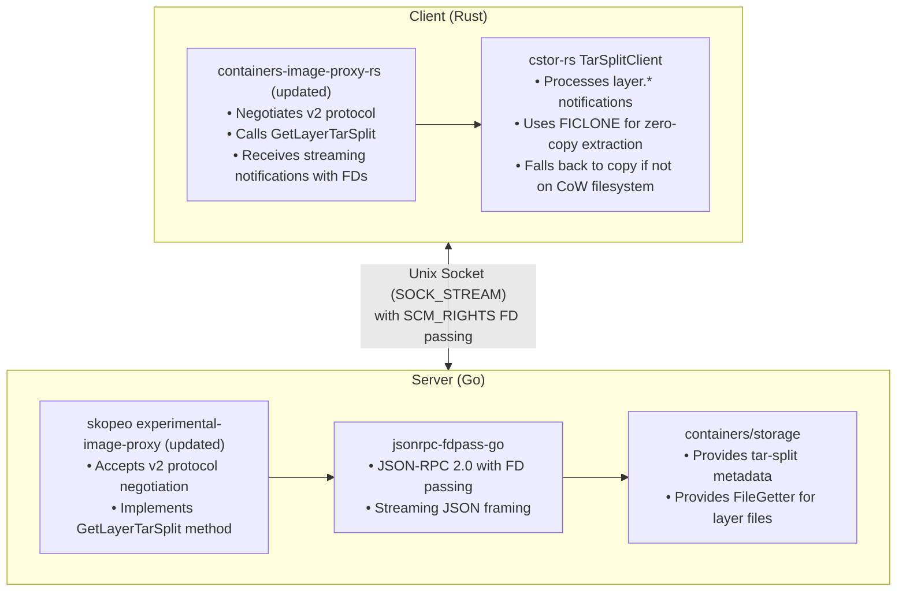

# Skopeo Image Proxy v2: Tar-Split + IPC Design

## Overview

This document describes a version 2 protocol for `skopeo experimental-image-proxy` that
enables efficient layer extraction using tar-split metadata and file descriptor passing.
The goal is to allow clients to perform zero-copy file extraction via reflinks when
the source files are on a copy-on-write filesystem.

## Motivation

The current proxy (v1) streams complete compressed or uncompressed layer blobs. Clients must:
1. Decompress the blob
2. Parse the tar stream
3. Extract each file to disk

This is inefficient when the layers already exist in containers-storage on a CoW filesystem,
because the proxy could instead pass file descriptors to the already-extracted files,
allowing the client to use `ioctl(FICLONE)` for zero-copy extraction.

## Protocol Changes

### Version Negotiation

The v2 protocol uses proper JSON-RPC 2.0 with streaming JSON parsing (no newline delimiters required).

**Initialization request:**
```json
{"jsonrpc":"2.0","method":"Initialize","params":{"version":2},"id":1}
```

**Response:**
```json
{"jsonrpc":"2.0","result":{"version":"2.0.0","capabilities":["tar-split-stream"]},"id":1}
```

If the proxy doesn't support v2, it falls back to v1 behavior.

### New Method: `GetLayerTarSplit`

Stream a layer as tar-split items with file descriptors for regular files.

**Request:**
```json
{"jsonrpc":"2.0","method":"GetLayerTarSplit","params":{"image_id":1,"layer_digest":"sha256:..."},"id":2}
```

**Response (streaming via notifications):**

The proxy sends a sequence of JSON-RPC notifications, each potentially with an attached FD:

1. **Stream start:**
```json
{"jsonrpc":"2.0","method":"layer.start","params":{"digest":"sha256:...","uncompressed_size":12345}}
```

2. **Segment (raw tar header/padding bytes):**
```json
{"jsonrpc":"2.0","method":"layer.segment","params":{"data":"<base64-encoded-bytes>"}}
```

3. **File entry (with FD via SCM_RIGHTS):**
```json
{"jsonrpc":"2.0","method":"layer.file","params":{"name":"bin/sh","size":1234,"mode":493,"uid":0,"gid":0,"fd":{"__jsonrpc_fd__":true,"index":0}}}
```

4. **Stream end:**
```json
{"jsonrpc":"2.0","method":"layer.end","params":{"checksum":"sha256:..."}}
```

5. **Final response:**
```json
{"jsonrpc":"2.0","result":{"success":true},"id":2}
```

### File Descriptor Placeholder

File descriptors are represented using the standard `jsonrpc-fdpass` placeholder:

```json
{"__jsonrpc_fd__": true, "index": 0}
```

Multiple FDs in a single message use indices 0, 1, 2, etc. FDs are passed via SCM_RIGHTS
ancillary data on the Unix socket.

## Implementation Architecture



## Backward Compatibility

- The proxy continues to support v1 protocol on the same socket
- Clients detect v2 support via the Initialize response
- If v2 is not available, clients fall back to GetBlob + local decompression

## Security Considerations

- File descriptors are passed with O_RDONLY
- The client must be trusted (same machine, same user or root)
- No new attack surface beyond existing containers-storage access

## Performance Benefits

On CoW filesystems (btrfs, XFS with reflink, etc.):
- Zero disk I/O for file data (just metadata)
- Instant "copy" via FICLONE
- Reduced memory usage (no decompression buffers)

Fallback on non-CoW filesystems:
- Still avoids decompression (files are already uncompressed in storage)
- Read from existing files instead of re-decompressing

## Implementation Plan

1. **Phase 1: jsonrpc-fdpass-go** (DONE)
   - Create Go implementation of JSON-RPC 2.0 with FD passing
   - Full test coverage

2. **Phase 2: Skopeo v2 handler**
   - Add `--protocol-version` flag to skopeo
   - Implement v2 initialization and negotiation
   - Add GetLayerTarSplit method using containers/storage APIs

3. **Phase 3: Rust client updates**
   - Update containers-image-proxy-rs to negotiate v2
   - Integrate cstor-rs for tar-split processing
   - Implement zero-copy extraction with FICLONE

4. **Phase 4: Integration testing**
   - End-to-end tests with real container images
   - Performance benchmarks on btrfs
   - Fallback testing on ext4
